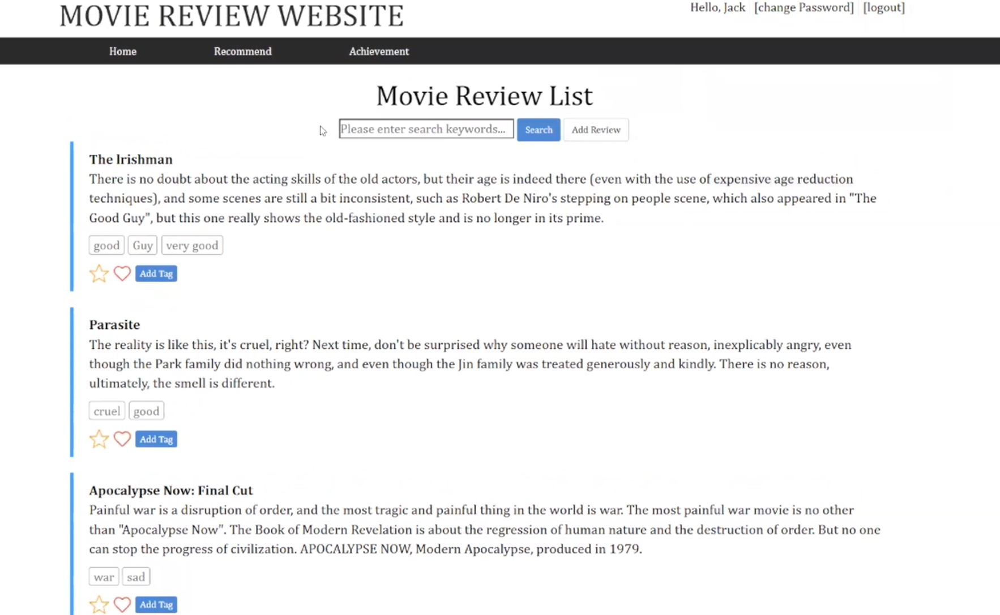

# Movie Website
This project developed a user-friendly and feature-rich movie review website.

Language: **PHP (Web Development), SQL (Data Storage)**

## Functions

- **Dynamic Movie Reviews**

Public Reviews: Share your insights by posting public reviews about the movies you've watched.

Main Page Display: Explore a dynamic main page featuring a curated collection of user reviews.

Sort by Ratings: Easily navigate through reviews by sorting them based on ratings.

- **Intelligent Search Functionality**
  
Keyword Search: Find specific movie reviews with ease by searching with relevant keywords.

- **Personalized User Experience**
  
Liked and Recommended Reviews: Bookmark your favorite reviews and recommendations for quick access.

Personal Page: View and manage your liked and recommended reviews in your personalized user space.

